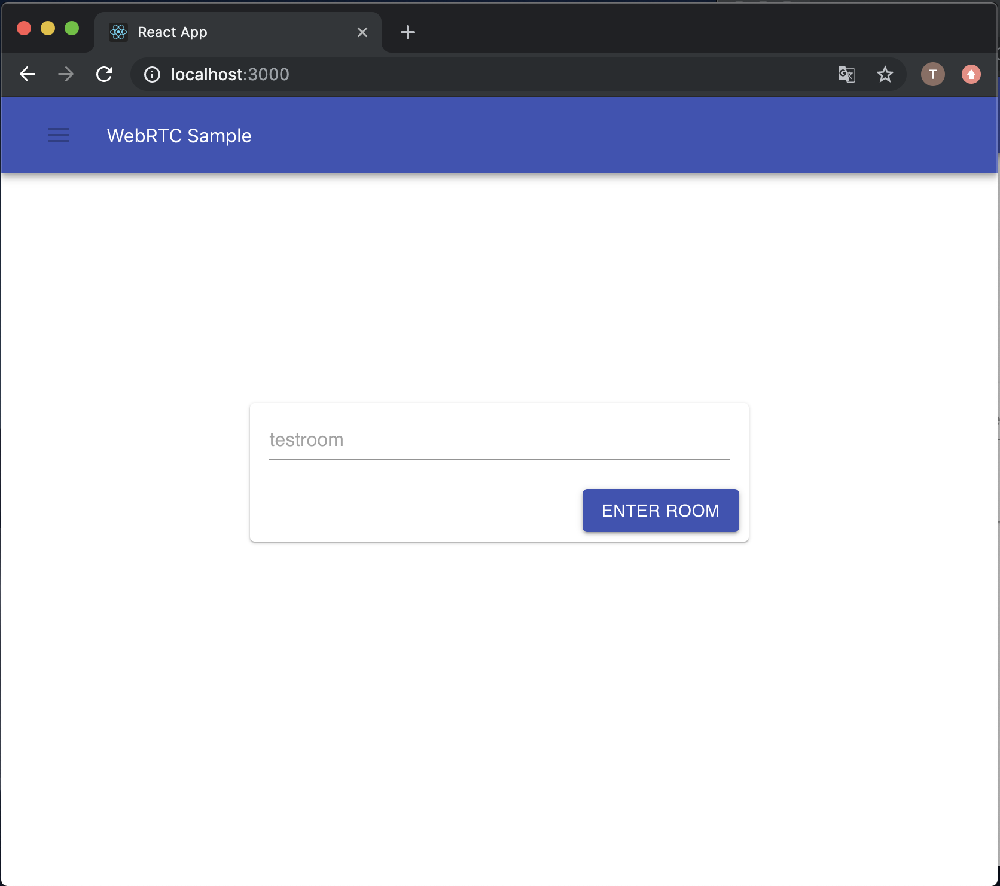
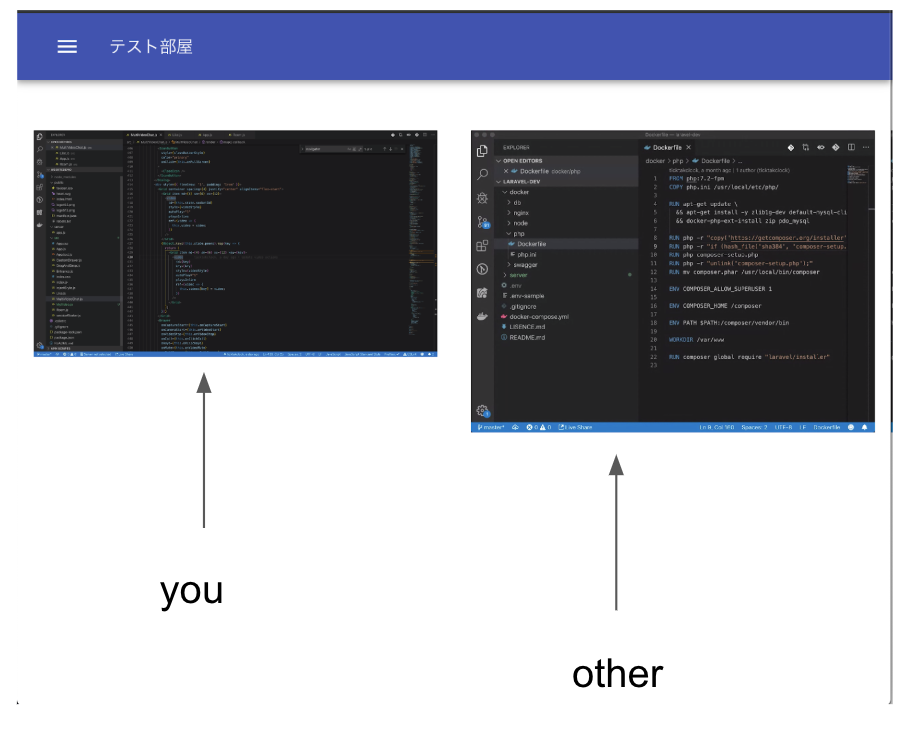
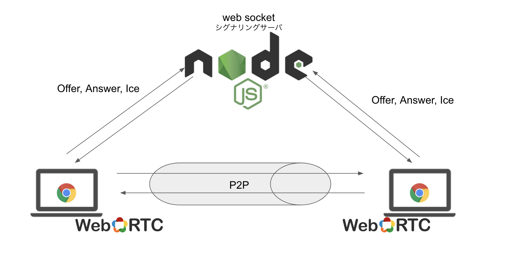
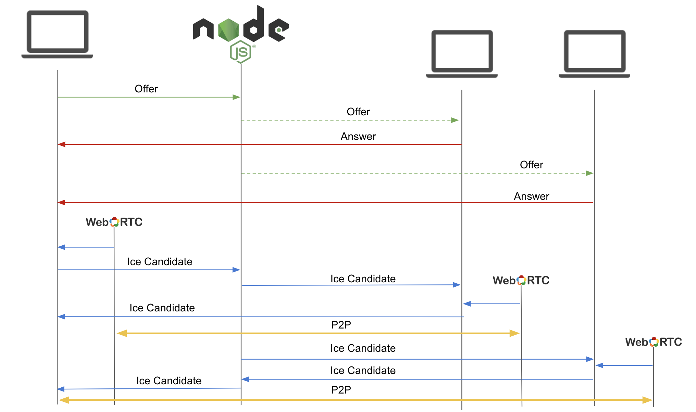
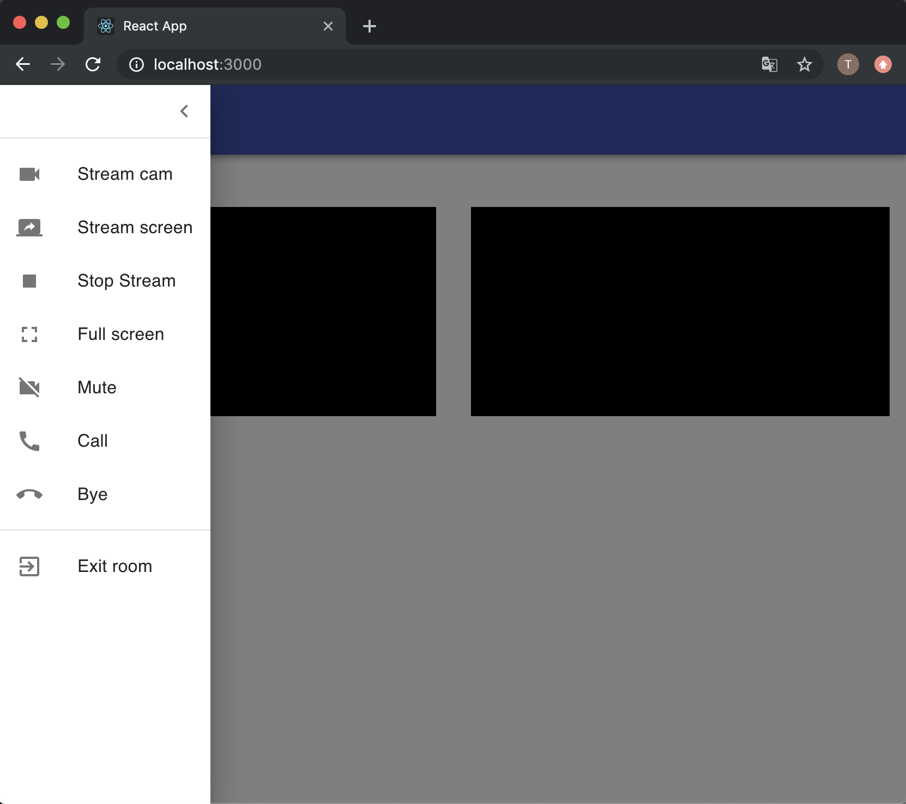
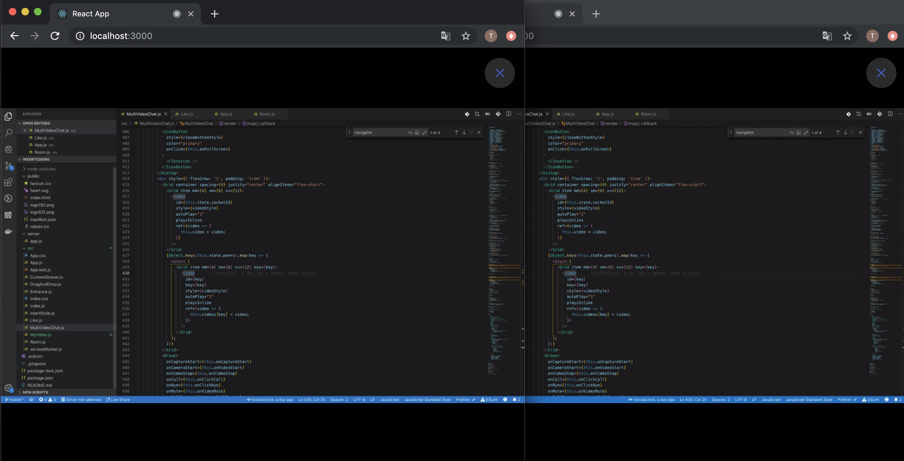
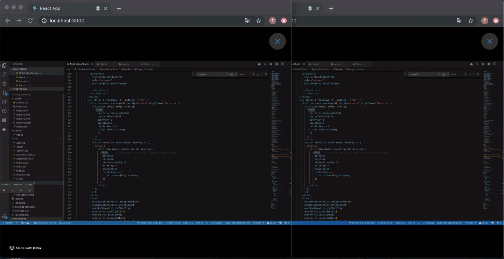

# Web RTC and Web Socket Demo

## Usage

```
$npm i
$node server/app.js        // launch web socket server
$npm start                 // launch client
```

Browse `http://localhost:3000/`

1. Enter room name

This is first view.



2. Stream screen

You can select stream from screen capture or video cam on menu.



Same step on other machine.

## Sytem



## WebRTC Sequence



## Menu



### Full screen



### Like reaction!! ❤️

In full screen case, you can LIKE ❤️ reaction on screen.


